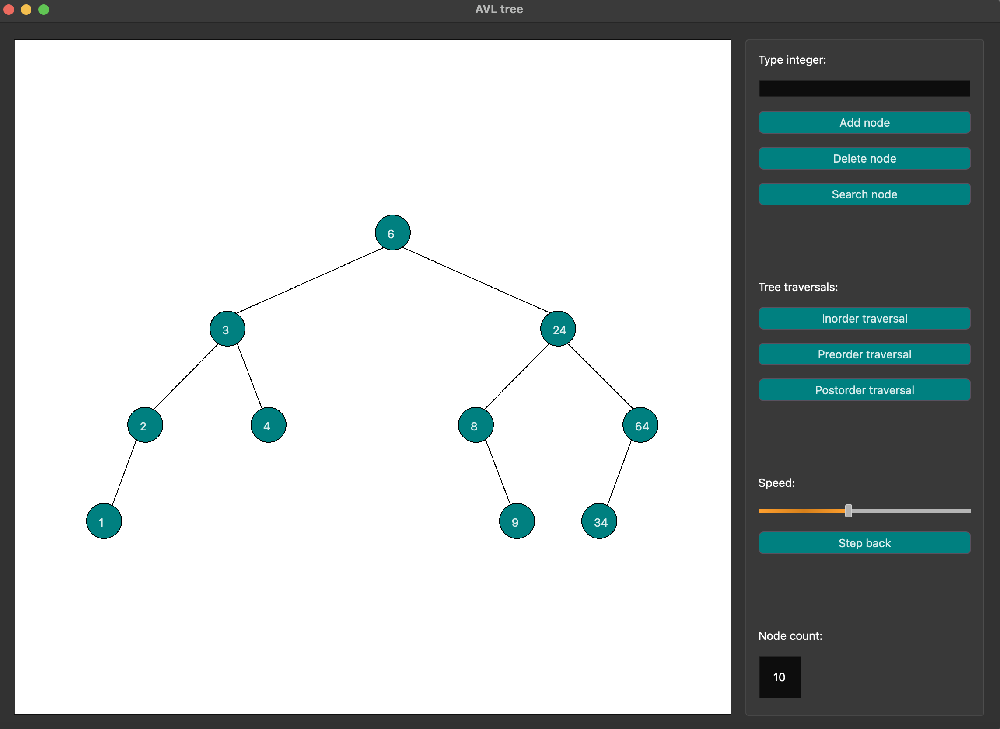

# AVL Tree 
This repository contains step-by-step AVL Tree visualising application written in C++ language. Project itself is Qt based, written in Clion.
It has diverse functionality, which involves not only insertion, deletion and search operations, but also allows to study traversal types.
What is more, to improve user's experience step back option and change of speed possibility are included.For those, who do not want to insert nodes one by one, possibility to download the whole tree from .txt file was included.\
In the following picture interace of the application is shown:\
\

# Project implementation
Implementation of application is based on MVC and observer pattern, where observable and observer are fields in a model class and view class, respectively. This was made on purpose to avoid a lot of inheritance. Interchange of data is established in the following way: Controller receives information from the View object and calls respective methods of model (addition, deletion or search). These methods change state of the model and notify about that view through observer and observable fields. Via these fields data is transferred from subject to subscribed observer, which draws updated AVL Tree.
# Build instructions
To build program user has to change options in CMakeLists.txt, so that they suit configurations of Qt application. Inside program, in file View.cpp inside constructor appropriate link to stylesheet.qss file should be provided (otherwise, colour of the buttons and slider will be lost).
